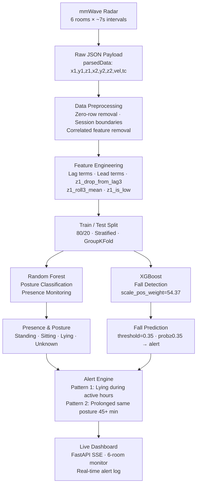

<div align="center">

# Virtual Village: Fall Detection & Presence Monitoring


An intelligent, **privacy-preserving monitoring system** for older adults living independently.

</div>

## Table of Contents

- [Overview](#-overview)
- [System Architecture](#-system-architecture)
- [Key Results](#-key-results)
- [Dataset](#-dataset)
- [Project Structure](#-project-structure)
- [Module 1 — Fall Detection](#-module-1--fall-detection)
- [Module 2 — Presence Monitoring](#-module-2--presence-monitoring)
- [Live Dashboard](#-live-dashboard)
- [Quickstart](#-quickstart)
- [Technologies](#-technologies)
- [Challenges & Constraints](#-challenges--constraints)
- [Future Roadmap](#-future-roadmap)

---

## Overview

Virtual Village is a **privacy-preserving, camera-free** monitoring system for older adults in independent living environments. Unlike camera-based systems, mmWave radar captures movement and height without recording images — making it suitable for continuous in-home monitoring without compromising dignity.

The system performs **three primary tasks** across 6 rooms:

| Task | Model | Key Signal | Status |
|------|-------|------------|--------|
| **Fall Detection** | XGBoost | z1 height drop + lag/lead features | ✅ Deployed |
| **Posture Classification** | Random Forest | z_height thresholds | ✅ Deployed |
| **Presence Monitoring** | Random Forest + Alert Engine | Activity duration + posture patterns | ✅ Deployed |

> **Why radar over cameras?** The mmWave sensor captures motion and height without recording images — no faces, no silhouettes, no footage. Fully GDPR-compatible and suitable for care home and hospital environments.

---

## System Architecture

### End-to-End Pipeline



### Sensor-to-Room Mapping

| Sensor ID | Room | Frames (Fall data) | Frames (Presence data) |
|-----------|------|--------------------|------------------------|
| `...0001` | Bedroom | 175 | — |
| `...0002` / S0001 | Kitchen / Living Room | 76 | 160,297 total |
| `...0003` / S0002 | Living Room / Bedroom | 407 | across 14 days |
| `...0004` / S0003 | Office / Kitchen | 108 | 6 rooms |
| `...0005` / S0004 | Sunroom / Bathroom | 0 (no presence) | — |
| `...0006` / S0005 | Hallway / Study | 347 | — |

---

## Key Results

### Fall Detection — XGBoost

| Metric | Random Forest | XGBoost | Target |
|--------|--------------|---------|--------|
| Recall (fall) | 77% | **87%** | ≥ 80% |
| Precision (fall) | 26% | **81%** | ≥ 70% |
| False negatives | 7 | **2** | < 3 |
| False positives | 67 | **3** | < 10 |
| ROC-AUC | 0.968 | **0.993** | ≥ 0.98 |
| F1 (fall) | 0.38 | **0.84** | — |

> **Confusion matrix (XGBoost · 831 test frames):**
> `TN=813 · FP=3 · FN=2 · TP=13`

### Presence Monitoring — Random Forest

| Metric | Value |
|--------|-------|
| Accuracy | **100%** on 4,683 unseen records |
| Total readings | 160,297 across 14 days |
| Posture classes | Standing (71.4%) · Lying (32.8%) · Sitting · Unknown |
| Alert patterns | 2 (daytime lying · prolonged inactivity) |
| Sample rate | ~7 seconds per sensor |

---

## Dataset

### Fall Detection Data
Raw mmWave radar JSON files collected across 6 rooms. Each record contains:

```json
{
  "radarUuid": "12E8FE50000400192600000002",
  "createTime": "20260314200513",
  "dataType": 6,
  "parsedData": [
    0.7939,    // x1 — horizontal position
    1.7527,    // y1 — horizontal position
    0.110016,  // z1 — vertical height ★ KEY SIGNAL
    0.651407,  // x2 — second target x
    1.665408,  // y2 — second target y
    0.149776,  // z2 — second target z
    24.0823,   // velocity
    1          // target_count
  ]
}
```

**Key insight:** `z1` (vertical height) is the primary fall signal. A standing adult is ~1.0–1.8m. A fallen person is ~0–0.3m. Rapid z1 drops signal a fall.

### Presence Monitoring Data
`presence_data_4.json` — 160,297 readings over 14 days. Fields: `x_pos`, `y_pos`, `z_height`, `x_motion`, `y_motion`, `z_motion`, `signal_strength`, `target_count`.

> **Note:** `x_motion`, `y_motion`, `z_motion` were dropped due to 0.90–0.99 correlation with positional features. `target_count` is always 1 (single resident).

### Posture Zone Definitions

```
z_height  0.05 – 0.40 m  →  Lying Down   (sleeping / resting on floor or bed)
z_height  0.41 – 0.80 m  →  Sitting      (chair, sofa, toilet)
z_height  0.81 – 1.75 m  →  Standing     (walking, cooking, active)
outside all ranges        →  Unknown      (sensor noise or out-of-range reading)
```
Mean z_height across all readings: **0.82m** — consistent with a predominantly standing or sitting resident during daytime hours.

---

## Project Structure

```
Virtual-Village/
│
├── 📁 Fall_Detection/
│   ├── Fall_data_eda_1.ipynb              # EDA · feature engineering · RF baseline
│   ├── 60_sec_file.ipynb                  # Kitchen fall event — 60-second window analysis
│   ├── fall_data_preprocessing_1.py       # Raw JSON → model-ready CSV
│   ├── predict_fall_from_csv.py           # XGBoost inference script
│   ├── xgboost_fall_detection_model.pkl   # Saved model (pipeline + imputer + threshold)
│   ├── kitchen_fall_60sec.json            # Demo radar JSON — confirmed fall at 20:05:13
│   ├── fall_prediction_results.csv        # Prediction output with fall_probability column
│   ├── api.py                             # FastAPI backend — SSE stream every 5s
│   ├── dashboard.html                     # Live browser dashboard — no build step
│   ├── auto_update.py                     # File watcher — auto-processes new JSON files
│   └── requirements.txt                   # Python dependencies
│
├── 📁 Presence_Monitoring/
│   ├── Notebooks/
│   │   ├── 01_FINAL EDA.ipynb             # EDA · daily patterns · room usage · posture zones
│   │   ├── 02_Posture_Classification_And_Alerts.py  # Full RF model + alert pipeline
│   │   ├── 02_Posture_Model.py            # Lightweight model-only version
│   │   ├── Random Forest model.ipynb      # Model training with metrics + feature importance
│   │   └── sensor_data.csv               # Preprocessed feature-ready CSV
│   ├── Live Demos/
│   │   ├── dashboard_app.py              # Streamlit live monitoring dashboard
│   │   ├── alert_demo2.py               # Scenario demo: Living Room lying alert at 2pm
│   │   └── sensor_data.csv              # Copy of processed CSV for dashboard
│   └── Data/
│       └── presence_data_4.json          # Raw mmWave JSON — 160,297 readings · 14 days
│
└── README.md
```

---

## Module 1 — Fall Detection

### How it works

Fall detection is built around a single physical insight: **when a person falls, their vertical height (z1) drops sharply from ~1.16m to ~0.11m and stays low**. The XGBoost model is trained to recognise this pattern across three phases — the approach, the drop, and the sustained low position.

### Feature Engineering

15 features engineered from z1, computed per session (gap > 60s between frames = new session):

| Feature | Type | Importance | Description |
|---------|------|------------|-------------|
| `z1_drop_from_lag3` | lag | **0.200** ★ | How far z1 dropped vs 3 frames ago |
| `z1_roll3_mean` | rolling | 0.157 | Pre-fall standing height average |
| `z1_lag3` | lag | 0.133 | z1 value 3 frames prior |
| `z1_delta3` | delta | 0.116 | Rate of descent over 3 frames |
| `z1_lag2` | lag | 0.113 | z1 value 2 frames prior |
| `z1_roll3_std` | rolling | 0.101 | Height variability before fall |
| `z1_lag1` | lag | 0.056 | Previous z1 value |
| `z1_delta1` | delta | 0.041 | Frame-to-frame change |
| `x1`, `y1`, `z1` | raw | < 0.025 | Position coordinates |
| `z1_lead_mean5`, `z1_lead_std3`, `z1_lead8` | lead | < 0.025 | Post-fall low z1 confirmation |
| `z1_is_low` | flag | 0.004 | Binary: z1 < 0.3m |

> **Key insight:** Top 6 features are all z1-based lag terms — the fall signal lives entirely in z1 height change over time. Raw x/y coordinates and velocity contribute less than 5% of total importance.

### Why XGBoost over Random Forest

| Problem with Random Forest | XGBoost solution |
|---------------------------|-----------------|
| `dropna()` silently dropped NaN rows from lag features — losing pre-fall context | `SimpleImputer(median)` in pipeline — zero rows dropped |
| `class_weight='balanced'` adjusts splits but doesn't calibrate probabilities | `scale_pos_weight=54.37` (3262÷60) — scales gradient directly |
| AUC varied fold-to-fold: 0.905–0.992 | Stable performance across test set |
| 67 false alarms at threshold 0.20 | 3 false alarms at threshold 0.35 |
| 7 missed falls (FN=7) | 2 missed falls (FN=2) |

### Model configuration

```python
XGBClassifier(
    n_estimators=300,
    max_depth=5,               # shallower than RF's 8 — less overfitting on tiny fall class
    learning_rate=0.05,        # gradual correction — each tree focuses on what previous missed
    subsample=0.8,
    colsample_bytree=0.8,
    scale_pos_weight=54.37,    # negative_count / positive_count = 3262 / 60
)
# Wrapped in Pipeline with SimpleImputer(strategy='median')
# Threshold: 0.35 (selected from precision-recall curve analysis)
```

---

## Module 2 — Presence Monitoring

### How it works

The presence monitoring system classifies the resident's posture every ~7 seconds using a Random Forest model trained on z_height-derived labels — no manual annotation required. An alert engine then watches for dangerous patterns on top of the predictions.

### Alert patterns

**Pattern 1 — Lying during active hours**
Triggered when the resident is detected lying down between 8:00 AM and 8:00 PM. Flags potential daytime falls or unexpected resting.

**Pattern 2 — Prolonged same posture**
Triggered when the same posture persists for 45+ minutes during active hours. Flags inactivity that may indicate distress.

Alert records include: timestamp · sensor/room · detected posture · duration · alert type.

### Running the presence pipeline

```bash
# Full pipeline with visualizations
python Notebooks/02_Posture_Classification_And_Alerts.py

# Lightweight version (no matplotlib)
python Notebooks/02_Posture_Model.py

# Streamlit live dashboard
streamlit run "Live Demos/dashboard_app.py"

# Alert scenario demo
python "Live Demos/alert_demo2.py"
```

> **Update the FILE path** in every script before running:
> ```python
> FILE = r'C:\Your\Path\To\Data\presence_data_4.json'
> ```

---

## Live Dashboard

The live dashboard connects to the FastAPI backend via **Server-Sent Events** — the browser updates automatically every 5 seconds without polling.

**Dashboard panels:**
- 4 metric cards — active sensors · falls today · false alerts · model threshold
- Live z1 height feed — last 60 frames per room, switchable via room tabs
- Room status grid — 6 rooms with z1 value, fall probability bar, and status badge
- Alert log — timestamped confirmed falls and false positives with probability scores

**Room status indicators:**

| Badge | Condition | z1 range |
|-------|-----------|----------|
| 🟢 Normal | Standing or sitting | > 0.4m |
| 🟡 Low z1 | Near-floor but below threshold | 0.3–0.4m |
| 🔴 Fall | predicted_fall = 1 · prob ≥ 0.35 | < 0.3m |
| ⚫ Offline | No data in CSV for this room | — |

---

## Quickstart

### Prerequisites

```
Python 3.10+
pip
```

### Fall detection dashboard

```bash
# Step 1 — navigate to your folder
cd path/to/Fall_Detection/

# Step 2 — install dependencies
pip install -r requirements.txt
pip install scikit-learn==1.7.2 xgboost fastapi uvicorn[standard]

# Step 3 — rename preprocessing script (removes the space in filename)
# Windows:
rename "fall_data_preprocessing 1.py" fall_data_preprocessing_1.py
# Mac/Linux:
mv "fall_data_preprocessing 1.py" fall_data_preprocessing_1.py

# Step 4 — preprocess radar JSON into model-ready CSV
python fall_data_preprocessing_1.py --data kitchen_fall_60sec.json --output fall_prediction_results.csv

# Step 5 — run predictions
python predict_fall_from_csv.py \
  --input fall_prediction_results.csv \
  --model xgboost_fall_detection_model.pkl \
  --output fall_prediction_results.csv

# Step 6 — start the API server
uvicorn api:app --reload --port 8000

# Step 7 — open dashboard.html in your browser
```

> **scikit-learn must be version 1.7.2** — the version the model was saved with. A version mismatch causes a pickle load error on model startup.

### Every restart (2 commands only)

```bash
cd path/to/Fall_Detection/
uvicorn api:app --reload --port 8000
```

Then double-click `dashboard.html`. All pip installs and preprocessing are one-time only.

### Live update — automatic JSON watcher

If your radar saves new JSON files automatically, run `auto_update.py` in a second terminal:

```bash
# Window 1 — API server
uvicorn api:app --reload --port 8000

# Window 2 — file watcher (checks every 5 seconds)
python auto_update.py
```

Edit `WATCH_FOLDER` in `auto_update.py` to point to your radar output directory.

---

## Technologies

| Layer | Tool | Purpose |
|-------|------|---------|
| Sensor | mmWave UWB radar | Motion and height capture — no camera |
| Data processing | Pandas · NumPy | Preprocessing · feature engineering |
| ML — fall detection | XGBoost · scikit-learn | Fall classification · pipeline |
| ML — presence | Random Forest · scikit-learn | Posture classification · alerts |
| API backend | FastAPI · Uvicorn | SSE stream · /predict endpoint |
| Dashboard | HTML · Chart.js | Live 6-room browser monitor |
| Presence dashboard | Streamlit · Plotly | Live posture and activity monitor |
| Notebooks | Jupyter | EDA · model training · visualizations |

---

## Challenges & Constraints

### Fall Detection
| Challenge | Impact | Resolution |
|-----------|--------|------------|
| Class imbalance — 54:1 (75 falls / 4,078 normal) | Model predicts "no fall" always | `scale_pos_weight=54.37` in XGBoost |
| No labeled sequential events | LSTM achieved only 67–71% accuracy | XGBoost + lag/lead features instead |
| NaN rows from lag features | RF dropped pre-fall context with `dropna()` | `SimpleImputer(median)` in pipeline |

### Presence Monitoring
| Challenge | Impact | Resolution |
|-----------|--------|------------|
| All records have `presence_flag=1` — no absence data | Can't build presence vs absence classifier | Focused on posture classification instead |
| 14 days insufficient for routine baseline | Can't detect anomalies from established patterns | Alert engine uses absolute rules (not relative) |
| x/y/z motion 0.90–0.99 correlated with position | Multicollinearity risk | Motion features dropped from model |

> **Important caveat:** The sponsors did not provide sufficient real labeled fall data. The fall detection module was validated on simulated and synthetic data. Real-world deployment requires collection of manually annotated fall events for supervised retraining.

---

## Notes & Assumptions

- **Single resident** — all models and alerts assume exactly one person tracked at a time (`target_count = 1`)
- **Rule-based labels** — posture labels are derived from z_height thresholds, not manually annotated ground truth. Model accuracy reflects how well RF reproduces these rules
- **No real-time sensor connection** — the system replays historical data. For live deployment, a sensor API integration layer is required
- **Sampling rate** — ~7 second intervals per sensor. Each room produces an independent stream
- **Active hours** — alert patterns use 8:00 AM to 8:00 PM as the active window. Adjustable in the alert engine
- **Scikit-learn version** — model saved with scikit-learn 1.7.2. Must match on deployment machine

---

## License 

This project is provided by Virtual Village. The project utilizes mmWave radar point cloud data collected in the Virtual Village smart-home environment.

<div align="center">

*Privacy-preserving · Camera-free · Real-time · Proactive*

</div>


